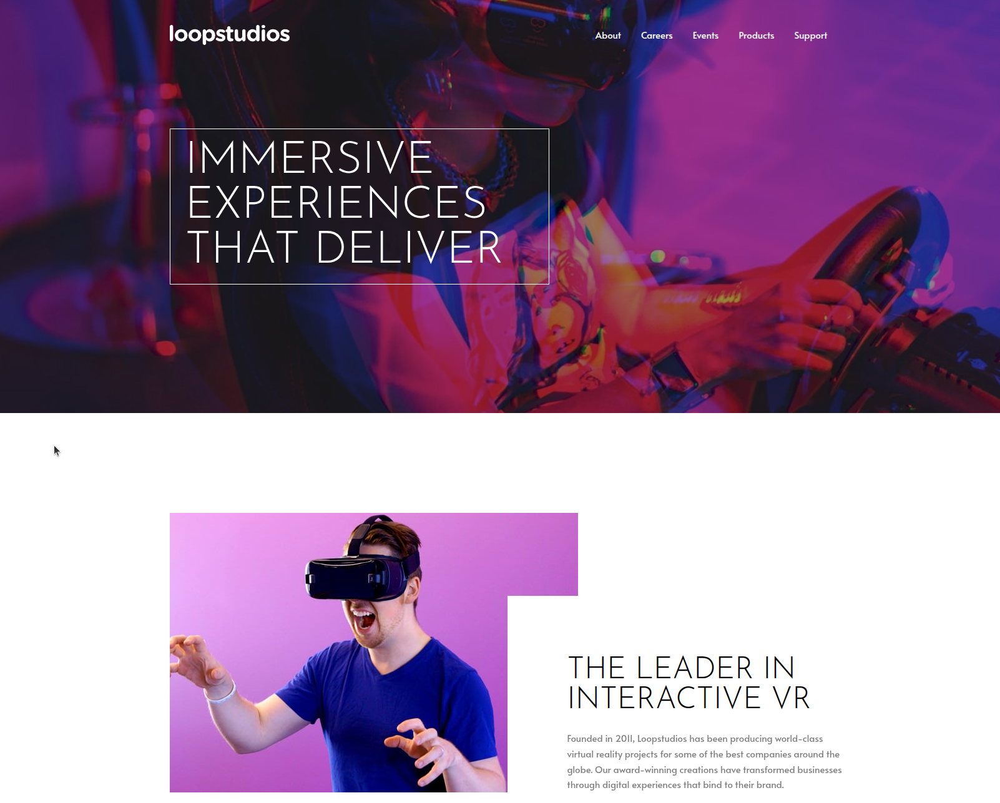

# Frontend Mentor - Loopstudios landing page solution

This is a solution to the [Loopstudios landing page challenge on Frontend Mentor](https://www.frontendmentor.io/challenges/loopstudios-landing-page-N88J5Onjw). Frontend Mentor challenges help you improve your coding skills by building realistic projects. 

## Table of contents

- [Overview](#overview)
  - [The challenge](#the-challenge)
  - [Screenshot](#screenshot)
  - [Links](#links)
- [My process](#my-process)
  - [Built with](#built-with)
  - [What I learned](#what-i-learned)
  - [Continued development](#continued-development)
- [Author](#author)

**Note: Delete this note and update the table of contents based on what sections you keep.**

## Overview

### The challenge

Users should be able to:

- View the optimal layout for the site depending on their device's screen size
- See hover states for all interactive elements on the page

### Screenshot



### Links

- Solution URL: [Source Code](https://github.com/elhuzain/loopstudios-landing-page)
- Live Site URL: [Live Preview](https://loopstudios-landing-page.elhuzain.com)

## My process

### Built with

- Semantic HTML5 markup
- CSS custom properties
- Flexbox
- CSS Grid
- Mobile-first workflow
- [TailwindCSS](https://tailwindcss.com/) - CSS Library

**Note: These are just examples. Delete this note and replace the list above with your own choices**

### What I learned

Building the overlapping image and text block were slightly challenging. I learned 2 ways of stacking:

First is using grid
```html
<div class="grid grid-cols-12">
  <!-- content -->
</div>
```

Then, on children, we give children overlapping column spans

The second is the one I went with, which is absolute positioning.
```html
<div class="absolute">
    <!-- content -->
<div>
```

### Continued development

Use this section to outline areas that you want to continue focusing on in future projects. These could be concepts you're still not completely comfortable with or techniques you found useful that you want to refine and perfect.

## Author

- Website - [elhuzain](https://elhuzain.com)
- Frontend Mentor - [@elhuzain](https://www.frontendmentor.io/profile/elhuzain)